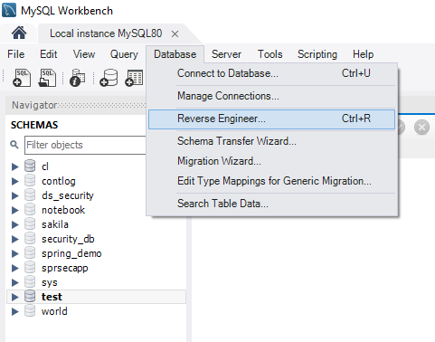

# ContLog


## БД и таблицы
1.

## Редактирование таблиц
#### 1. Удаление строки таблицы
```
USE cl;
ALTER TABLE containerdrs DROP COLUMN started, DROP COLUMN finished;
```
#### 2. Поиск КТК по Владельцу КТК с местом нахождения
```
use cl;
SELECT c.id, c.code, c.number, c.type, c.weighttare, c.maxweight, c.place,
			CASE  
              WHEN c.place = 'd' AND c.place_id IS NOT NULL THEN CONCAT('Водитель: ', d.surename, ' ', d.name)
              WHEN c.place = 'd' THEN 'Водитель не найден'
              WHEN c.place = 't' AND c.place_id IS NOT NULL THEN CONCAT('Терминал: ', t.short_name) 
              WHEN c.place = 't' THEN 'Терминал не найден' 
              WHEN c.place = 'r' AND c.place_id IS NOT NULL THEN CONCAT('Жел/дор : ', 'Место не найдено') 
              WHEN c.place = 'r' THEN 'Место не найдено'
              WHEN c.place = 's' AND c.place_id IS NOT NULL THEN CONCAT('Мор/тра : ', 'Место не найдено') 
              WHEN c.place = 's' THEN 'Место не найдено'
              WHEN c.place = 'b' AND c.place_id IS NOT NULL THEN CONCAT('Ремонт  : ', t.short_name) 
              WHEN c.place = 'b' THEN 'Место не найдено'
              WHEN c.place = 'o' AND c.place_id IS NOT NULL THEN CONCAT('Продажа : ', t.short_name)
              WHEN c.place = 'o' THEN 'Место не найдено'
              WHEN c.place = 'x' AND c.place_id IS NOT NULL THEN 'Загр.' 
              WHEN c.place = 'x' THEN 'Страна не найдена'
              ELSE CONCAT(c.place, ':', COALESCE(c.place_id, 'NULL'))
              END AS 'Место' ,
            c.contowner_id
            FROM container c 
            LEFT JOIN driver d ON c.place = 'd' AND d.id = c.place_id 
            LEFT JOIN terminal t ON c.place = 't' AND t.id = c.place_id 
            WHERE c.contowner_id = 1;
```
следует ввести исправления, для* *символов b, o, s, x

#### 3. Поиск КТК по Владельцу КТК с местом нахождения
Для создания диаграммы БД в MySQL WorkBench необходимо в
меню Database выбрать пункт Reverse Engineer...
и далее по шагам пройти до конца.
В итоге получи диаграмму со всем связями.
